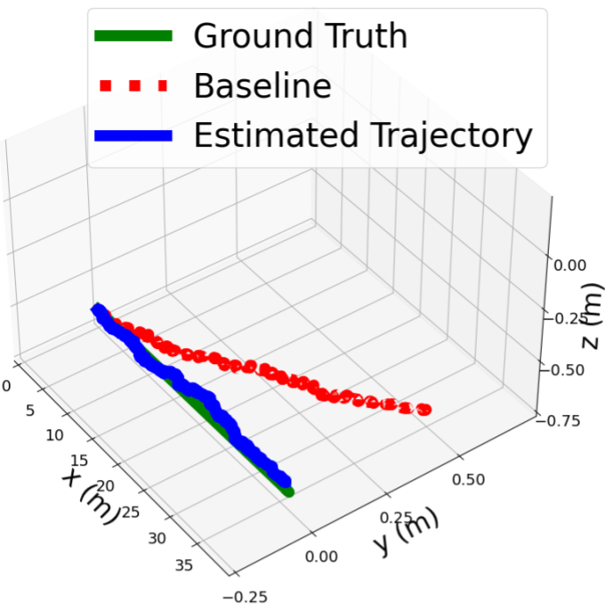

## Experiment-Forward Development and Testing

As our goal is to deploy systems in real world scenarios, we emphasize to test our methods in common scenarios and create experiments that may replicate real-world conditions.

### Uncertainty-Aware State Estimation and Mapping for Underwater Robots

In this project, we use our experiments to investigate how environmental disturbances that exist in highly dynamic marine environments impact sensors commonly used in marine engineering and navigation applications.

In order to do this, we rigidly mount the Frog BlueROV equiped with a DVL and a sonar (in addition to other navigation sensors) on a linear carriage in a wave basin. We then induce waves with different charcteristics, varying the amplitude and wavelength, and ensuring that we keep them as ordinary waves to improve test reproducability.

We log measurements from the acoustic sensors, and as we know what the target measurement should be, following proper calibration routines, we can empricially determine the induced noise and bias on the sensor measurements.

We provide videos from these experiments below.

    <video autoplay="autoplay" src="../images/waves_robot.mp4" controls="controls" width="49%"></video>
    <video autoplay="autoplay" src="../images/waves_in_front.mp4" controls="controls" width="49%"></video>

In addition to the experiments with the waves, we use the position readings on the wave carriage to track the ground-truth position of the robot during our tests, as the robot is rigidly mounted.

This gives us the opportunity to then compare our state estimation and mapping methods, as we now have a ground truth trajectory to both qualitatively, and quantitatively evaluate our methods with. We show qualitative results in the figure below, where the ground truth reference trajectory is compared against our baseline method and our proposed method.

  

